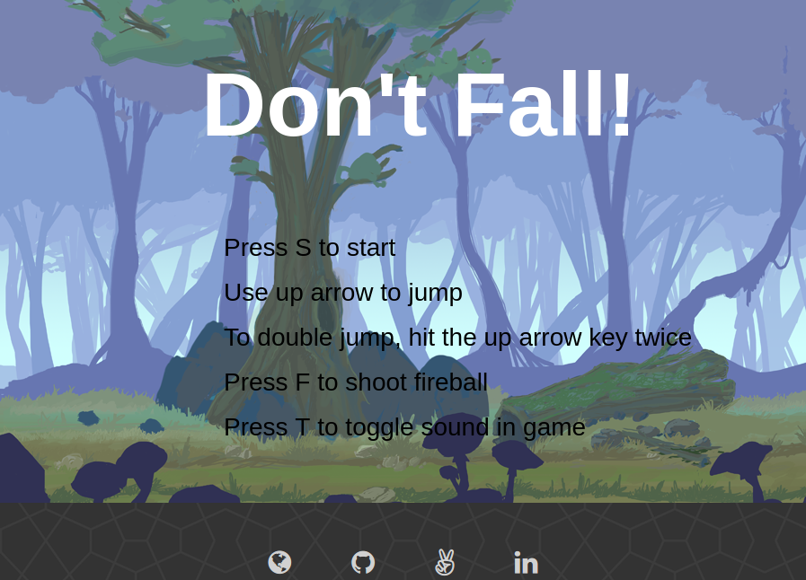

# Don't Fall

## Architecture and Technologies

This project was implemented with the following technologies:

- Vanilla `JavaScript` and `jQuery` for overall structure and game logic,
- `Easel.js` with `HTML5 Canvas` for DOM manipulation and effects rendering,
- Webpack to bundle js files.

## About
Don't fall is a platform jumper game. You play as the Jumper. The Jumper must continue to run on platforms. A high score is given based on how far one goes before falling off the screen.

## Controls
The controls are below:
* S: begins the game
* Enter: restarts the game if the jumper has fallen.
* Up Arrow: jump
* Up Arrow (x2): double jump (when jumping from the platforms)
* F: shoot fireball
* T: toggle sound in game

## How to Play
To Play:  [Live][game]

You will see the following start screen, which lays out the controls:



Jump from platform to platform:


[game]: http://www.rithyhuot.com/dontfall/
## Game world generation

### Generate Jumper

```javascript
onImageLoaded(e) {
  let spriteSheet = new createjs.SpriteSheet({
    images: ['assets/stickman.png'],
    frames: {width: 180, height: 340, regX:0, regY:0},
    animations: { run: [0, 69, 'run', 2] }
  });

  this.jumper = this.stage.addChild( new createjs.Sprite(spriteSheet));
  this.jumper.setTransform(0, 0, 0.3, 0.3);
  this.jumper.gotoAndPlay('run');
  this.jumper.y = 100;
  this.jumper.x = 0;
}
```

### Generate Platform

```javascript
generatePlatform(){
  if (this.platforms.length < 4) {
    const platform = new Platform(this.stage,this.world);
    this.platforms.push(platform);
    let x = Math.random()*100 + 350;

    for (let i = 0; i < 2; i++) {
      let y = Math.random()*200 + 300;
      let newPlatform = new Platform(this.stage, this.world, x, y);
      this.platforms.push(newPlatform);

      this.lastPlatformX = x;
      x += Math.random()*100 + 350;
    }
  }
}
```

### Dynamically move old platform to the front

```javascript
  movePlatformToEnd(platform, jumperBounds) {
    if (jumperBounds.x > platform.platform.x + 600) {
      this.lastPlatformX += Math.random()*100 + 350;
      platform.platform.x = this.lastPlatformX;
      platform.platform.y = Math.random()*200 + 300;
      this.stage.update();
    }
  }
```

### Collision Detection

```javascript
this.platforms.forEach((platform) => {
  let platformBounds = platform.platform.getTransformedBounds();
  let jumperBounds = jumper.getTransformedBounds();
  this.movePlatformToEnd(platform, jumperBounds);

  if (jumperBounds.intersects(platformBounds)) {
    if (platformBounds.y > jumperBounds.y && velocity.y > 0) {
      jumper.y = platformBounds.y - 100;
      this.onGround = true;
      platformX = platformBounds.x + platformBounds.width;
    }
  }
})
```
